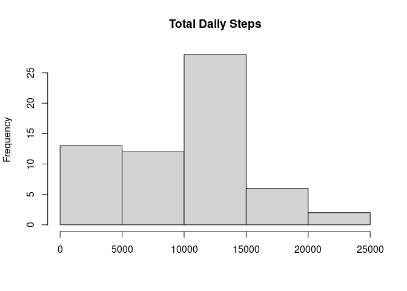
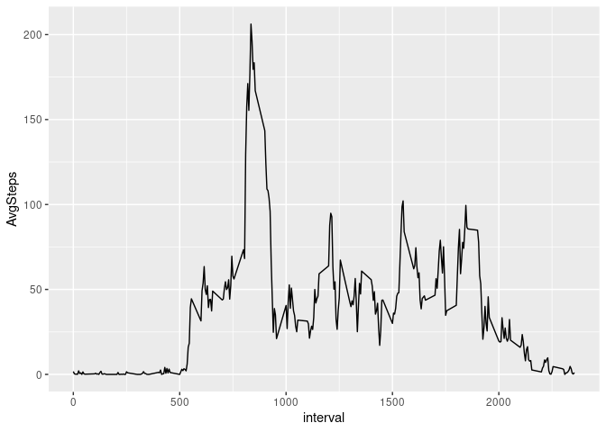
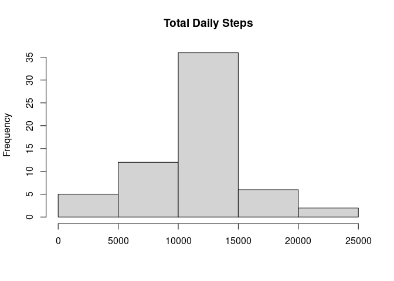
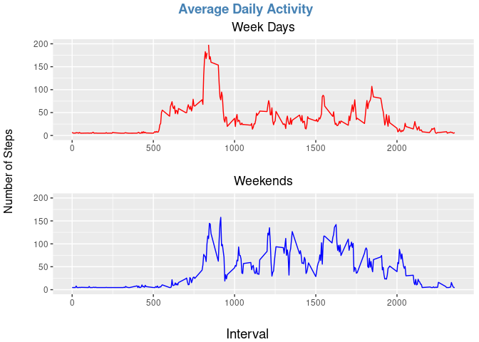

## Load required libraries

```r
library(ggplot2)
library(dplyr)
```

```
## 
## Attaching package: 'dplyr'
```

```
## The following objects are masked from 'package:stats':
## 
##     filter, lag
```

```
## The following objects are masked from 'package:base':
## 
##     intersect, setdiff, setequal, union
```

```r
library(simputation)
library(ggpubr)
```

## Loading and preprocessing the data


```r
movements<-read.csv("activity.csv",header = TRUE,sep = ",")
# Convert char to Date
movements$date<-as.Date(movements$date,format="%Y-%m-%d")
```


## What is mean total number of steps taken per day?

For this part of the assignment, you can ignore the missing values in the dataset.

    1. Calculate the total number of steps taken per day

    2. Make a histogram of the total number of steps taken each day

    3. Calculate and report the mean and median of the total number of steps taken per day


```r
totalStepsPerDay<-aggregate(movements$steps, by=list(movements$date), FUN=sum, na.rm=TRUE)
colnames(totalStepsPerDay) <- c('Date', 'TotalSteps')
totalStepsMean<-mean(totalStepsPerDay$TotalSteps)
totalStepsMedian<-median(totalStepsPerDay$TotalSteps)
hist(totalStepsPerDay$TotalSteps,main="Total Daily Steps",xlab="")
```

<!-- -->

The median number of steps taken per day is 10395  

The mean number of steps taken per day is 9354.2295082  


## What is the average daily activity pattern?

```r
intervalActivity <- movements %>%
  na.omit() %>%
  group_by(interval) %>%
  dplyr::summarize(AvgSteps = mean(steps)) %>% 
  as.data.frame()

pl<-ggplot(data=intervalActivity,aes(interval,AvgSteps))
pl+geom_line()
```

<!-- -->

```r
dailyActivity <- movements %>%
  na.omit() %>%
  group_by(date, interval) %>%
  dplyr::summarize(AvgSteps = mean(steps)) %>% 
  as.data.frame()
```

```
## `summarise()` has grouped output by 'date'. You can override using the `.groups` argument.
```

```r
maxDaily<-dailyActivity[which.max(dailyActivity$AvgSteps),]
```

The 5-minute interval, on average across all the days in the dataset, contains the maximum number of steps is interval 615 on 2012-11-27 with a value of 806 steps  


## Imputing missing values


```r
missingSteps<-sum(is.na(movements$steps))
missingDate<-sum(is.na(movements$date))
missinginterval<-sum(is.na(movements$interval))
```

There are 2304 missing values for Steps,  0 missing values for Date and 0 missing values for interval  

### Create a new dataset that is equal to the original dataset but with the missing data filled in


```r
cleanMovements<-impute_lm(movements,steps ~ date)
cleanStepsPerDay<-aggregate(cleanMovements$steps, by=list(cleanMovements$date),FUN=sum)
colnames(cleanStepsPerDay) <- c('Date', 'DailySteps')
hist(cleanStepsPerDay$DailySteps,main="Total Daily Steps",xlab="")
```

<!-- -->

```r
cleanTotalStepsMean<-mean(cleanStepsPerDay$DailySteps)
cleanTotalStepsMedian<-median(cleanStepsPerDay$DailySteps)
diffMean<-abs(totalStepsMean - cleanTotalStepsMean)
diffMedian<-abs(totalStepsMedian - cleanTotalStepsMedian)
```
The median number of steps taken per day is 1.0781098\times 10^{4}  

The mean number of steps taken per day is 1.0767174\times 10^{4}  

The difference in the mean between the two data set is 1412.9443888  

The difference in the median between the two data set is 386.0983075  

The median frequency of the steps has increased from 25 to 35


## Are there differences in activity patterns between weekdays and weekends?


```r
cleanMovements$dayOfWeek<-factor(weekdays(cleanMovements$date))
# Add a column that indicates if the day of the week falls on a weekend
movementsByDayOfWeek <- cleanMovements %>%
  mutate(Weekend = as.logical(case_when(
    dayOfWeek == "Saturday" ~ "T",
    dayOfWeek == "Sunday" ~ "T",
    TRUE ~ "F")))

# Get the dataset for weekdays
weekdayMovements <- movementsByDayOfWeek %>%
   filter(Weekend == F)

# Get the dataset for the weekend movements
weekendMovements <- movementsByDayOfWeek %>%
   filter(Weekend == T)

# Calculate the average daily steps for each dataset
weekdayActivity <- weekdayMovements %>%
  group_by(interval) %>%
  dplyr::summarize(AvgSteps = mean(steps)) %>% 
  as.data.frame()
weekendActivity <- weekendMovements %>%
  group_by(interval) %>%
  dplyr::summarize(AvgSteps = mean(steps)) %>% 
  as.data.frame()

# Create the plots for the datasets
weekdayPlot<-ggplot()+geom_line(data=weekdayActivity,aes(interval,AvgSteps),color="red") + ylab("") + xlab("") + labs(title = "Week Days") + theme(plot.title = element_text(hjust = 0.5)) +ylim(0,200)
weekendPlot<-ggplot()+geom_line(data=weekendActivity,aes(interval,AvgSteps),color="blue") + ylab("") + xlab("") + labs(title = "Weekends") + theme(plot.title = element_text(hjust = 0.5)) +ylim(0,200)

# Arrange the panels
figure <- ggarrange(weekdayPlot,weekendPlot,ncol = 1)
annotate_figure(figure,
                top = text_grob("Average Daily Activity ", color = "steelblue", face = "bold", size = 14),
                bottom = text_grob("Interval", color = "black", size = 14),
                left = text_grob("Number of Steps", color = "black", rot = 90))
```

<!-- -->

There seems to be a significant increase in the steps for the interval between 1000 and 2000 for the weekend

